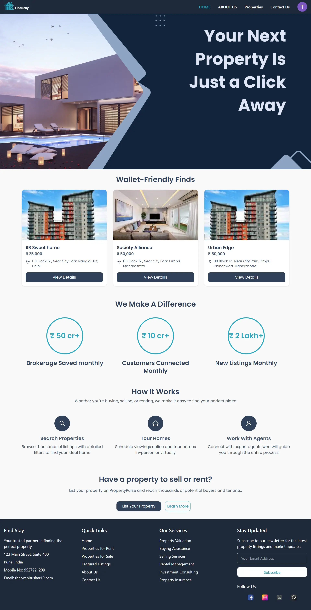

# 🏠 FindStay

FindStay is an online platform for **buying**, **selling**, and **renting** properties.  
Users can **list their property**, **schedule home visits**, **raise queries**, and communicate with property owners.  
It supports secure authentication, email notifications, and Google login.

---

## 🚀 Features

### 🏡 Property Management

- **CRUD operations** for property listings.
- Add property details including images (stored via **Cloudinary**).
- Filter and search listings for buying or renting.

### 📅 Scheduling

- Schedule **home tours/home visits** with date & time.
- Owners receive notifications for scheduled visits via mail.

### 📬 Contact & Queries

- 📬 Contact & Queries
  Users can raise a query or contact the FindStay support team directly via the platform.

- The message is stored in MongoDB for record-keeping and further action.

- Admins can view and respond to these queries.

### 🔐 Authentication & Security

- Create an account **manually** or sign in with **Google**.
- **OTP-based password reset** via email.
- Welcome email after successful registration.

### 📧 Email Notifications

- OTP verification for password reset.
- Welcome email on signup.
- Notification for upcoming home tour.
- Securely handled via **Nodemailer** + Gmail SMTP.

---

## 🛠️ Tech Stack

**Frontend**

- React (TypeScript)
- TanStack Query (React Query) for API state management
- Tailwind CSS

**Backend**

- Node.js
- Express.js
- MongoDB (Mongoose ORM)
- Cloudinary (image storage)
- Firebase (Google Authentication - optional)

**Other Tools**

- Git (Version Control)
- Postman (API testing)

---

## 📂 Project Structure

```bash
findstay/
│
├── frontend/                # React + TypeScript frontend
│   ├── src/
│   ├── public/
│   └── package.json
│
├── server/                # Node.js + Express backend
│   ├── src/
│   │   ├── routes/        # API endpoints
│   │   ├── controllers/   # Business logic
│   │   ├── models/        # Mongoose schemas
│   │   ├── db/            # Database connection Logic
│   │   ├── utils/         # Helper functions (Cloudinary, Nodemailer, etc.)
│   │   └── app.js
│   ├── .env
│   └── package.json
│
└── README.md
```

## ⚙️ Installation & Setup

### 1️⃣ Clone the repository

- git clone: https://github.com/ttushaar1906/mern-Estate/

### 2️⃣ Install dependencies

- cd server
- npm install

- cd ../frontend (for frontend)
- npm install

### 3️⃣ Environment Variables

#### Backend

- PORT=5000
- MONGO_URI=your-mongodb-uri
- JWT_SECRET=your-jwt-secret
- MAILEMAIL=your-gmail-address
- MAILPASSWORD=your-gmail-app-password
- CLOUDINARY_CLOUD_NAME=your-cloudinary-cloud-name
- CLOUDINARY_API_KEY=your-cloudinary-api-key
- CLOUDINARY_API_SECRET=your-cloudinary-api-secret
- FIREBASE_API_KEY=your-firebase-api-key
- FIREBASE_AUTH_DOMAIN=your-firebase-auth-domain

#### Frontend

- REACT_APP_API_URL=http://localhost:5000
- REACT_APP_FIREBASE_API_KEY=your-firebase-api-key
- REACT_APP_FIREBASE_AUTH_DOMAIN=your-firebase-auth-domain

### 4️⃣ Run the project
#### Backend
- cd server
- npm run dev

#### frontend
- cd frontend
- npm start

### 🧪 Testing
- You can use Postman to test all backend API routes before integrating with the frontend.

### 🤝 Contributing
Pull requests are welcome! Please fork the repo and create a new branch for your feature.

### 👨‍💻 Author
- Tushar Tharwani
- 📧 tharwanitushar19@gmail.com
- 🌐 https://tushartharwani.netlify.app/

#

